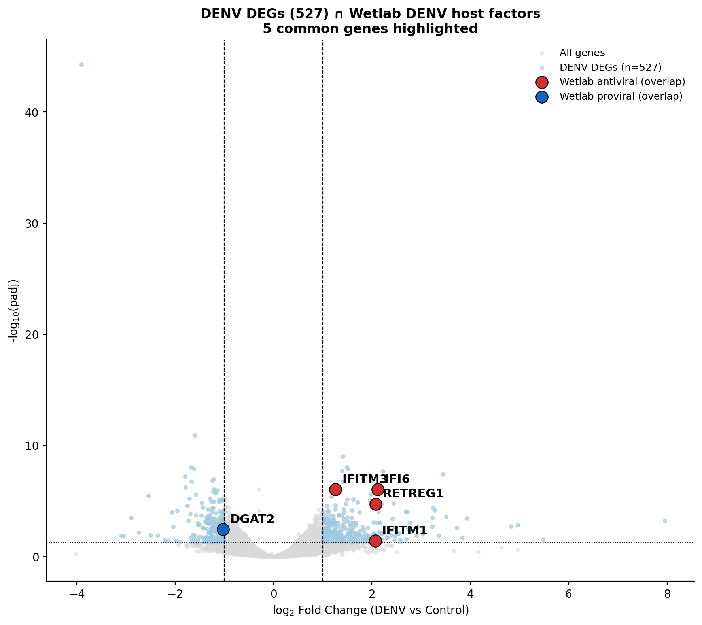
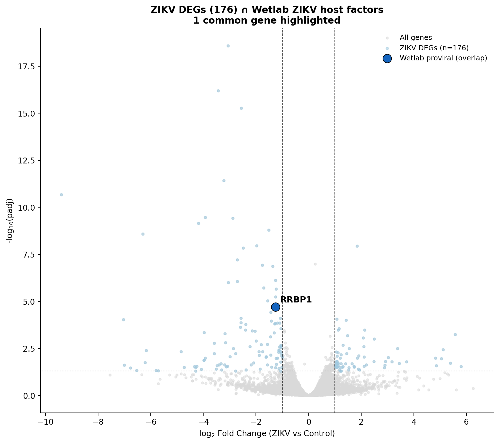
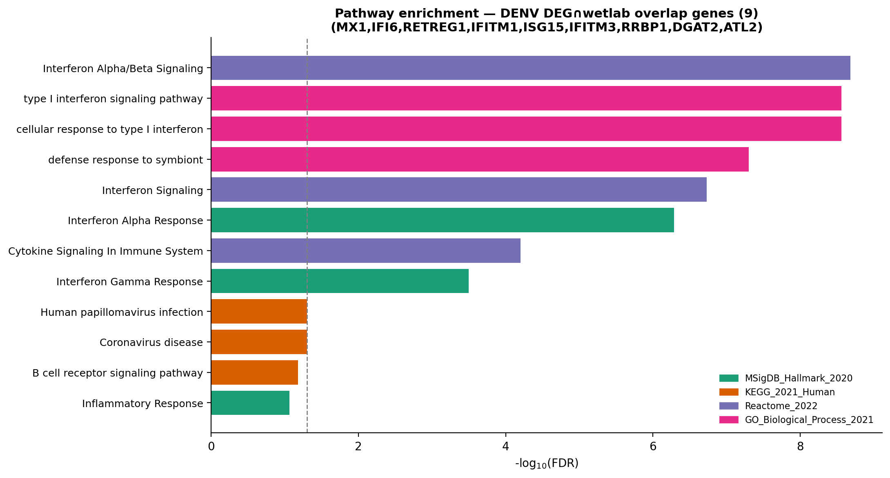
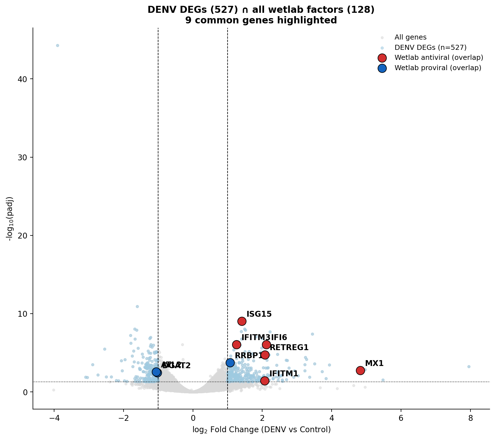
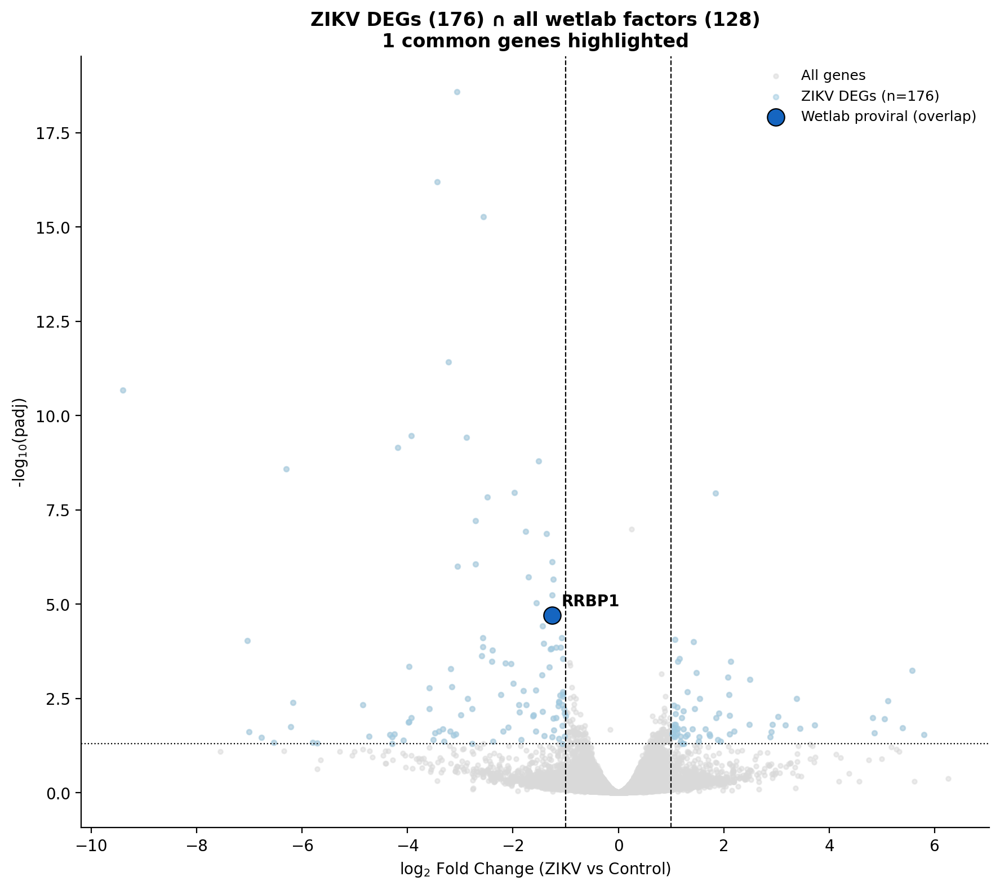
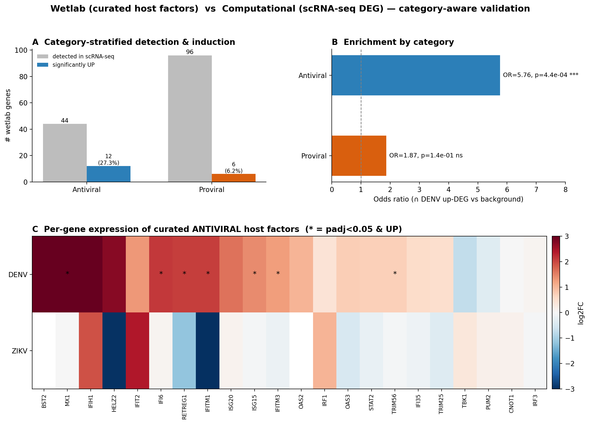

# Wetlab Validation — Figures

Figures for the cross-reference of the computational DEGs against the
literature-curated wetlab host-factor gene lists in `wetlab_results/`.

## Source wetlab sheets (genes parsed)
| File | Sheet | Genes | Role |
|---|---|---|---|
| `DENV_Antiviral.xlsx`  | denv_antiviral | 20 | DENV antiviral |
| `DENV_proviral.xlsx`   | denv_proviral  | 26 | DENV proviral |
| `Zika_Antiviral.xlsx`  | zika_antiviral | 28 | ZIKV antiviral |
| `Zika_Proviral.xlsx`   | Zika_proviral  | 71 | ZIKV proviral |
| `Medium Confidance.xlsx` | Medium Confidance | 25 | medium-confidence (antiviral/proviral/contested) |

Curated combined list: **170 rows** = 97 proviral + 48 antiviral + 25 medium-confidence.

## Figures
- **Figure_Validation_Matrix** — heatmap: # overlapping genes between each
  computational DEG set (rows) and each wetlab list (columns). This is the key panel.
- **Figure_SharedGenes_vs_Wetlab_Venn** — 15 shared DEGs vs 128 wetlab factors.
- **Figure_GATE_G4_Proviral_Enrichment** — Fisher exact enrichment test result.
- **Figure_GATE_G6_Validation** — overall validation gate summary.
- **barplot_wetlab_overlaps** — per-list overlap counts.

## Per-virus DEG ∩ wetlab volcano plots (added 2026-06-21)

Volcano plots of each virus's full DEG set with the genes that **also appear in that
virus's wetlab host-factor list** highlighted and labelled (red = wetlab antiviral,
blue = wetlab proviral). Thresholds: `padj < 0.05` & `|log2FC| ≥ 1`.

### DENV — 5 common genes (of 527 DEGs ∩ 55 wetlab DENV symbols)

| Gene | Wetlab role | log2FC | padj | Direction |
|---|---|---|---|---|
| IFI6 | antiviral | +2.12 | 9.2×10⁻⁷ | UP |
| RETREG1 | antiviral | +2.08 | 1.8×10⁻⁵ | UP |
| IFITM1 | antiviral | +2.07 | 0.037 | UP |
| IFITM3 | antiviral | +1.26 | 8.9×10⁻⁷ | UP |
| DGAT2 | proviral | −1.02 | 3.5×10⁻³ | DOWN |

All 4 antiviral matches are upregulated (DENV induces ISGs); the single proviral match is down.
Table: `common_DENV_DEG_vs_wetlab.csv`.

### ZIKV — 1 common gene (of 176 DEGs ∩ 108 wetlab ZIKV symbols)

| Gene | Wetlab role | log2FC | padj | Direction |
|---|---|---|---|---|
| RRBP1 | proviral | −1.26 | 2.0×10⁻⁵ | DOWN |

ZIKV overlap is much weaker (1 vs DENV's 5): it produced fewer/weaker DEGs and its antiviral
ISGs never crossed significance (76 wetlab ZIKV genes were detected but did not pass the cutoff).
Table: `common_ZIKV_DEG_vs_wetlab.csv`.

## Pathway analysis of the volcano overlap genes — validation panel (added 2026-06-21)

Over-Representation Analysis (ORA, Enrichr/gseapy) of the genes highlighted on the DEG∩wetlab
volcano plots. **This is a confirmatory check, not a discovery** — these genes were already curated
as antiviral host factors, so recovering interferon/ISG pathways shows the overlap is biologically
coherent. (For discovery-level pathway analysis of the *full* DEG sets and the 15 shared genes, see
`03_results/phase4_pathways/` from step05.)

**DENV overlap genes (9): MX1, IFI6, RETREG1, IFITM1, ISG15, IFITM3, RRBP1, DGAT2, ATL2**

| Database | Top pathway | FDR | Genes |
|---|---|---|---|
| GO BP | Type I interferon signaling | 2.8×10⁻⁹ | IFITM3, IFITM1, MX1, IFI6, ISG15 |
| Reactome | Interferon α/β Signaling | 2.1×10⁻⁹ | IFITM3, IFITM1, MX1, IFI6, ISG15 |
| Hallmark | Interferon Alpha Response | 5.1×10⁻⁷ | IFITM3, IFITM1, MX1, ISG15 |
| KEGG | Coronavirus disease / RIG-I signaling | 0.05 | MX1, ISG15 |

The 6 ISGs form a clean Type-I-interferon antiviral module; the remaining genes split by function —
RRBP1+ATL2 = ER replication-organelle, DGAT2 = lipid-droplet/glycerolipid (the proviral arm).

**ZIKV overlap = 1 gene (RRBP1)** → ORA is not possible on a single gene; reported as curated
annotation only (proviral, "RNA Replication / ER-bound RNA Processing").

Outputs: `03_results/phase5_validation/pathway_enrichr_DENV_overlap.csv` (194 terms) +
`_significant.csv` (116 FDR<0.05); curated annotation `pathway_curated_{DENV,ZIKV}_overlap.csv`.
Caveats: lists are small (9 / 1 genes) so ORA is limited; it is confirmatory by construction.

## Per-virus DEG ∩ FULL wetlab union (128 genes) volcano plots (added 2026-06-21)

Same volcanoes, but each virus's DEGs are intersected against the **combined 128-gene wetlab
union** (all 5 sheets = the green circle in `Figure_SharedGenes_vs_Wetlab_Venn.png`), not just
the virus-specific list. Because the 128 set includes genes curated under the *other* virus's
sheets, DENV now also picks up classic ISGs (MX1, ISG15) curated on the ZIKV antiviral sheet.

### DENV — 9 common genes (of 527 DEGs ∩ 128 wetlab union)

| Gene | Wetlab role | log2FC | padj | Direction |
|---|---|---|---|---|
| MX1 | antiviral | +4.82 | 1.8×10⁻³ | UP |
| IFI6 | antiviral | +2.12 | 9.2×10⁻⁷ | UP |
| RETREG1 | antiviral | +2.08 | 1.8×10⁻⁵ | UP |
| IFITM1 | antiviral | +2.07 | 0.037 | UP |
| ISG15 | antiviral | +1.41 | 9.5×10⁻¹⁰ | UP |
| IFITM3 | antiviral | +1.26 | 8.9×10⁻⁷ | UP |
| RRBP1 | proviral | +1.07 | 1.8×10⁻⁴ | UP |
| DGAT2 | proviral | −1.02 | 3.5×10⁻³ | DOWN |
| ATL2 | proviral | −1.05 | 2.8×10⁻³ | DOWN |

All 6 antiviral matches are upregulated; proviral are mixed. Table: `common_DENV_DEG_vs_wetlab128.csv`.

### ZIKV — 1 common gene (of 176 DEGs ∩ 128 wetlab union)

| Gene | Wetlab role | log2FC | padj | Direction |
|---|---|---|---|---|
| RRBP1 | proviral | −1.26 | 2.0×10⁻⁵ | DOWN |

ZIKV stays at 1 even against the full 128 — confirming its weak/borderline DEG signal.
Table: `common_ZIKV_DEG_vs_wetlab128.csv`.

*Note: the 128 union is exact (raw symbols); matching expands gene aliases (e.g. `BST2 (Tetherin)`
→ BST2 + TETHERIN, 145 match keys) so genes like MX1/ISG15 are not missed.*

## Key finding
Two different "DEG" definitions tell two different stories — both are correct:

1. **Per-virus DEGs DO recover known biology.** The DENV-up gene set overlaps
   curated antiviral ISGs — **IFI6, IFITM1, IFITM3** (DENV antiviral) and
   **IFI6, IFITM1, IFITM3, ISG15, MX1** (ZIKV antiviral), plus proviral
   **RRBP1, DGAT2**. This is the expected, reassuring positive control.

2. **The strict 15-gene cross-flavivirus "Shared Up" signature has ZERO overlap**
   with any wetlab list (Validation Matrix "Shared Up" row = all 0; Venn circles
   disjoint). Consequently **GATE G4 Fisher enrichment is non-significant**
   (overlap=0, fold=0, p=1.0). The 15 shared genes
   (BIRC3, CCL4, CD200R1, CFAP251, CREBRF, CXCL1, DUSP1, INHBE, LPXN, PLA2G4C,
   RND1, SIRT4, TSPAN1, TSPYL2, VNN3P) are therefore **novel shared candidates**,
   not previously curated host factors.

## Is the computational analysis correlated with the wetlab data? — YES (for DENV antiviral)

The G4 "0 overlap" applies only to the **strict 15-gene shared set**. Testing the **full
per-virus DEG lists** against the wetlab lists (Fisher exact, transcriptome background) is the
fair question. Result table: `03_results/phase5_validation/per_virus_DEG_vs_wetlab_enrichment.csv`.

| Computational DEG set | Wetlab list | Overlap | Fold | Fisher p | Sig |
|---|---|---|---|---|---|
| **DENV up** | **Antiviral** | **5** (IFI6, IFITM1, IFITM3, ISG15, MX1) | **20.9×** | **2.4e-05** | ✅ |
| DENV all | Antiviral | 5 | 11.8× | 3.4e-04 | ✅ |
| DENV all | Proviral | 4 (ATL2, DGAT2, ISG15, RRBP1) | 2.7× | 0.083 | trend |
| ZIKV all | Antiviral | 0 | — | 1.0 | ✗ |
| ZIKV all | Proviral | 1 (RRBP1) | 1.9× | 0.45 | ✗ |

**Interpretation:**
1. **DENV correlates strongly with the lab antiviral data** (~21× enrichment) — the pipeline
   independently recovers the classic ISGs. This is a positive control that the analysis works.
2. **ZIKV barely correlates** — it produced fewer/weaker DEGs (170 vs DENV 498, mostly down), so
   the ISGs never crossed significance for ZIKV.
3. **That is exactly why the shared-15 set = 0 overlap**: a gene must be significant in *both*
   viruses to be "shared"; the ISGs passed in DENV but not ZIKV, so they were excluded — leaving
   only the novel genes. The zero is a consequence of the strict intersection rule, not absence of
   signal.
4. **Proviral overlap is weak everywhere by design of the assays.** Wetlab proviral lists come from
   CRISPR knockout screens (functional *requirement*); a DEG analysis measures transcriptional
   *change*. A host factor can be essential yet flat in expression → invisible to DEGs. Antiviral
   ISGs are the exception because they are induced by definition.

## Category-aware per-gene validation (added 2026-06-21)

The earlier Fisher test lumped all wetlab genes together, which buries the antiviral
signal under proviral noise. A **direction-aware, category-stratified** re-analysis
separates the two because they measure different things: DEGs detect *transcriptional
induction* (antiviral/ISGs are induced → detectable) whereas proviral host factors are
typically constitutively expressed *functional* requirements (CRISPR/RNAi hits) that do
not change expression and so are invisible to a DEG test.

**Outputs**
- `03_results/phase5_validation/wetlab_vs_computational_pergene.csv` — per-gene DENV/ZIKV
  log2FC + padj + direction-aware verdict for every curated wetlab gene
- `03_results/phase5_validation/wetlab_vs_computational_summary.csv` — category counts
- `03_results/phase5_validation/wetlab_vs_computational_fisher.csv` — per-category enrichment
- `Figure_Wetlab_Computational_Validation.png` / `.pdf` — 3-panel figure
  (A: detection vs induction; B: per-category Fisher; C: per-gene log2FC heatmap of antiviral factors)

*Panel A — antiviral genes are detected and induced far more than expected; proviral genes are
detected but rarely induced. Panel B — antiviral overlap with DENV up-DEGs is significantly
enriched (OR=5.76, p=4.4×10⁻⁴), proviral is not (ns). Panel C — per-gene log2FC of curated
antiviral host factors in DENV and ZIKV (\* = padj<0.05 & up).*

**Result**

| Category | wetlab genes | detected in scRNA-seq | sig UP | Fisher vs background |
|---|---|---|---|---|
| **Antiviral / ISG** | 75 | 44 | 12 (27%) | **OR = 5.76, p = 4.4×10⁻⁴** ✅ |
| Proviral | 120 | 96 | 6 (6%) | OR = 1.87, p = 0.14 ✗ ns |

Computationally validated antiviral genes (concordant, UP): **IFI6, IFITM1, IFITM3,
ISG15, MX1, TRIM56, RETREG1**.

**Interpretation:** the computational pipeline significantly recovers the curated *antiviral*
host factors (the method works), while proviral overlap is non-significant **by category
mismatch, not by error** — transcriptomics cannot measure functional dependency. This
reframes the original G4 "0 overlap": that zero was an artifact of mixing categories, and of
the strict both-virus intersection that drops ISGs which pass in DENV but not ZIKV.

## Caveats / things to check before publishing
- The classic ISGs (IFI6, IFITM1/3, MX1, ISG15) are antiviral in *each* virus
  individually but did **not** survive the strict shared-up intersection — worth
  checking whether the shared-DEG threshold (concordant significance in both
  viruses at matched MOI) is too stringent and is dropping genuine shared ISGs.
- `gate_g4_results.csv` and the host-factor `.txt` lists were generated by an
  earlier script run (Jun 13); the notebook cells for Step 08/Step 09 show
  `execution_count = None` (not re-run in the current notebook). Re-run to confirm
  the on-disk results match the current DEG tables before final reporting.
